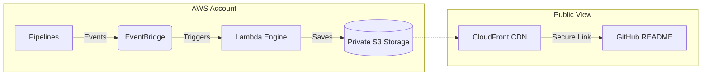

# � AWS Build Badges Engine

### What is this?
A simple tool that automatically puts "Build Status" badges on your GitHub README for all your AWS CodePipelines and CodeBuild projects. It updates instantly and even shows an **animated progress bar** while your code is actually deploying!

---

## 🏗️ How it Works (The Components)

This tool is built with 4 simple pieces that handle everything automatically:

| Component | What it does |
| :--- | :--- |
| **� The Ear (EventBridge)** | Listens to your AWS account. It instantly notices the millisecond a pipeline starts or finishes. |
| **🧠 The Brain (Lambda)** | The "Engine". It looks up who pushed the code (Author), the Commit ID, and then draws a custom SVG badge. |
| **🔒 The Safe (S3)** | A private storage bucket where all your badge images are kept secure. Nobody can access it directly. |
| **🌐 The Delivery (CloudFront)** | A high-speed global network that securely delivers your badges to GitHub so they load fast for anyone, anywhere. |

---

## � Architecture



---

## �🔥 Why this is better than others

1. **Live Animation**: When your build is running, the badge shows a moving gold stripe so you know it's "In Progress".
2. **Infinite Metadata**: It doesn't just show "Pass/Fail". It shows **Commit ID**, **Who pushed it**, and **When**.
3. **Ghost Purge**: It automatically forces GitHub to refresh its image cache the moment a build finishes. No more "stale" badges!
4. **Zero Maintenance**: Once you deploy the template, you never have to touch it again. It auto-discovers every new pipeline you create.

---

## 🛠️ Get Started in 2 Minutes

### 1. Deploy the Stack
Run this in your terminal to create the tool in your AWS account:

```bash
aws cloudformation deploy \
    --template-file aws_build_badges_cf_template.yml \
    --stack-name build-badges-tool \
    --capabilities CAPABILITY_NAMED_IAM \
    --parameter-overrides AppName=dx-badges
```

### 2. Add to your README
Once deployed, you can use your CloudFront URL to link images. 

**Pro Tip:** Use the included script to generate your dashboard automatically!
```bash
bash scripts/generate-dashboard.sh <your-repo> <your-cloudfront-url> <your-pipeline-name>
```

---
<sub>*Built for developers who want beautiful, real-time CI/CD dashboards.*</sub>
